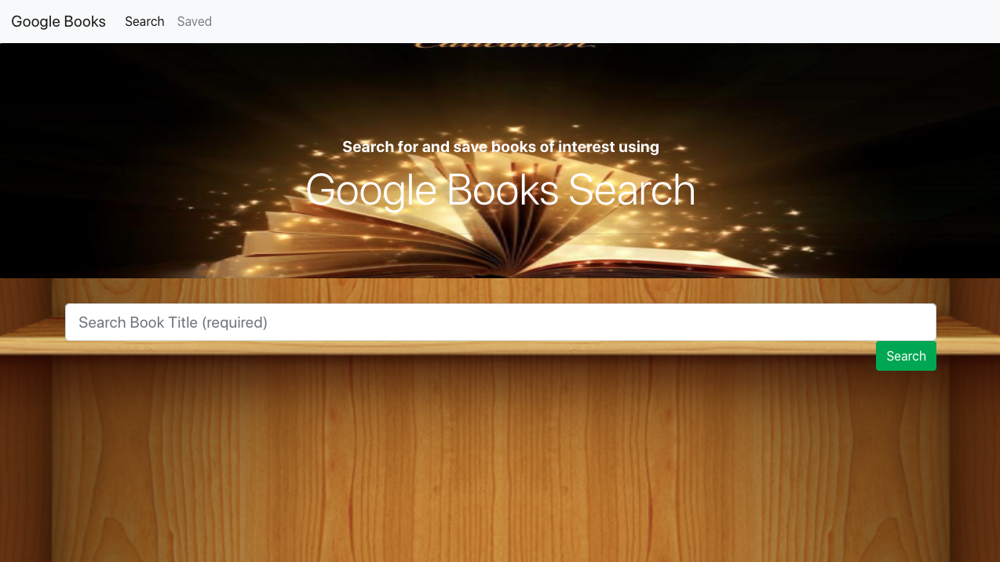

# Google-Books-Search-React-App
### Anne Jordan, Amanda Amos, Joewan Eiland, and Steffi Wellington
 
## How to Use
 
####Search for a book. 

> -Input a title of a book, or a word in a title, in the search bar.
> -Hit the submit button.
> -Peruse the results.
> -Click the saved button to add the book to your saved book list. 
 

####Head over to the Saved page to see your selections. 
> -Click delete to remove a book from your saved list. 
 

#### Click the image to go check out this Google Books App

 ## Technologies
*  React
*  Express
*  Axios
*  Mongoose
*  react-router-dom
*  JavaScipt
*  HTML5
*  CSS
*  Bootstrap

